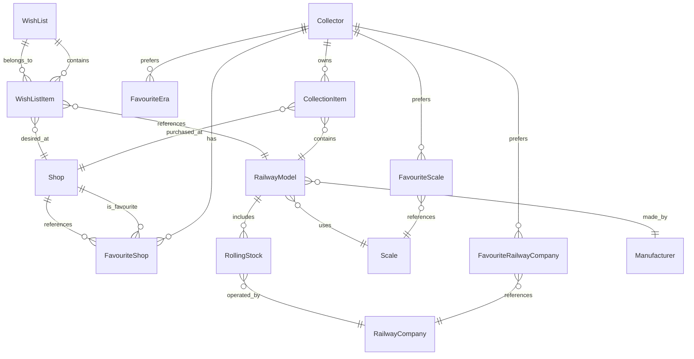

# Data Model Documentation

## Introduction

This document provides an overview of the RustHouse data model for managing model railway collections, wish lists, shops, manufacturers, scales, railway companies, and related entities. The model is designed for a GTK4 desktop application using SQLite, supporting efficient organization, search, and management of model railway assets and collector preferences.

## Entities

- **Collector**: Represents the owner of the collection and wish lists. Each collector manages a single personal collection and can create multiple wish lists. Collectors can define preferences such as preferred currency, system of measure, favourite scales, favourite railway companies, and favourite eras.

- **Manufacturer**: Describes a company that produces model railway items. Includes company details, contact information, and business status. **ID format:** `urn:manufacturer:{name}` (URL-encoded).

- **Railway Model**: Represents a specific product made by a manufacturer, identified by product code, scale, descriptive details, and power method. Each model can include one or more rolling stock items. All rolling stock for a model shares the same power method, which can be one of: AC (alternate current), DC (direct current), or Trix express. Each railway model has a category, which can be one of: locomotive, freight car, passenger car, electric multiple unit, railcar, train set, or starter set. **ID format:** `urn:model:{manufacturer name}-{product code}` (URL-encoded).

- **Scale**: Defines the modeling scale (e.g., H0, N, Z) and associated properties such as ratio and track gauge. **ID format:** `urn:scale:{name}` (URL-encoded).

- **Rolling Stock**: Represents an individual railway item (locomotive, freight car, passenger car, electric multiple unit, or railcar) that is part of a model. Includes details like category, railway company, and physical attributes. The rolling stock category can be one of: locomotive, freight car, passenger car, electric multiple unit, or railcar. **ID format:** `urn:rollingstock:{model_urn}-{road_number}` (URL-encoded).

  - For **locomotives**, **railcars**, and **electric multiple units**: includes type (for locomotives: diesel, steam, electric; for railcars and EMUs: power car, trailer car), depot name, livery, series, control (no DCC, DCC ready, DCC fitted, DCC sound), and socket type (one of: NONE, NEM_355, NEM_356, NEM_357, NEM_359, NEM_360, NEM_362, NEM_365) for digital decoder. Also includes coupler properties: whether the model mounts a close coupler (`has_close_coupler`), has a standard coupler socket (`has_standard_coupler_socket`), or has a digital controller coupler (`has_digital_controller_coupler`).
  - For **passenger cars**: includes passenger car type (one of: baggage cars, combine cars, compartment coaches, dining cars, double deckers, driving trailers, lounges, observation cars, open coaches, railway post offices, sleeping cars), livery, and service level (first class, second class, third class).
  - For **freight cars**: includes freight car type (one of: auto transport cars, brake wagons, container cars, covered freight cars, deep well flat cars, dump cars, gondolas, heavy goods wagons, hinged cover wagons, hopper wagons, refrigerator cars, silo container cars, slide tarpaulin wagons, sliding wall boxcars, special transport cars, stake wagons, swing roof wagons, tank cars, telescope hood wagons) and livery.
  - For all rolling stock: optional body shell type and chassis type (allowed values: metal die cast, plastic).

- **Railway Company**: Describes a real-world railway company, including its name, country, status, and contact information. **ID format:** `urn:railway:{name}` (URL-encoded).

- **Shop**: Represents a retailer or vendor where models can be purchased or are desired. Includes contact and location details. Shops can be managed independently and marked as favourites by the user. **ID format:** `urn:shop:{name}` (URL-encoded).

- **FavouriteShop**: Represents the user's preferred shops for purchases, allowing quick access and management. Each collector can have multiple favourite shops.

- **CollectionItem**: Represents an item owned by a collector, including ownership details, purchase information, and links to the model and shop.

- **WishList**: A named list of desired models for a collector. Identified by a URN.

- **WishListItem**: An item in a wishlist, referencing a model and optionally a shop and price.

- **FavouriteScale**: Links a collector to their preferred scales.

- **FavouriteRailwayCompany**: Links a collector to their preferred railway companies.

- **FavouriteEra**: Links a collector to their preferred historical eras.

## Entity Relationship Diagram



## Database Schema

```
Collector(
    id INTEGER PRIMARY KEY,
    name TEXT NOT NULL,
    preferred_currency TEXT,           -- ISO 4217 currency code (e.g., EUR, USD)
    preferred_measure TEXT             -- 'mm' or 'inches'
)

Scale(
    id TEXT PRIMARY KEY,                -- URN: urn:scale:{name}
    name TEXT NOT NULL,           -- e.g., H0, N, Z, O, G
    ratio TEXT NOT NULL,          -- e.g., 1:87, 1:160
    track_gauge TEXT NOT NULL,    -- enum: Standard, Narrow
    gauge REAL NOT NULL,          -- mm or inches
    description TEXT,             -- optional
    created_at TEXT NOT NULL,     -- creation timestamp (ISO 8601)
    last_modified_at TEXT,        -- last change timestamp (ISO 8601, optional)
    version INTEGER NOT NULL DEFAULT 1
)

RailwayCompany(
    id TEXT PRIMARY KEY,                -- URN: urn:railway:{name}
    name TEXT NOT NULL,
    country TEXT NOT NULL,
    status TEXT NOT NULL,            -- enum: Active, Inactive
    website_url TEXT,                -- optional
    linkedin TEXT,                   -- optional
    facebook TEXT,                   -- optional
    twitter TEXT,                    -- optional
    instagram TEXT,                  -- optional
    youtube TEXT,                    -- optional
    description TEXT,                -- optional
    created_at TEXT NOT NULL,        -- creation timestamp (ISO 8601)
    last_modified_at TEXT,           -- last change timestamp (ISO 8601, optional)
    version INTEGER NOT NULL DEFAULT 1
)

Manufacturer(
    id TEXT PRIMARY KEY,                -- URN: urn:manufacturer:{name}
    name TEXT NOT NULL,
    registered_company_name TEXT, -- optional
    kind TEXT,                   -- enum: Industrial, Brass Metal Models
    status TEXT,                 -- enum: Active, Out of Business
    email TEXT,                  -- optional
    website_url TEXT,            -- optional
    phone_number TEXT,           -- optional
    street_address TEXT,         -- optional
    city TEXT,                   -- optional
    state TEXT,                  -- optional
    postal_code TEXT,            -- optional
    country TEXT,                -- optional
    linkedin TEXT,               -- optional
    facebook TEXT,               -- optional
    twitter TEXT,                -- optional
    instagram TEXT,              -- optional
    youtube TEXT,                -- optional
    created_at TEXT NOT NULL,    -- creation timestamp (ISO 8601)
    last_modified_at TEXT,       -- last change timestamp (ISO 8601, optional)
    version INTEGER NOT NULL DEFAULT 1
)

RailwayModel(
    id TEXT PRIMARY KEY,                -- URN: urn:model:{manufacturer name}-{product code}
    manufacturer_id TEXT NOT NULL REFERENCES Manufacturer(id),
    product_code TEXT NOT NULL,
    description TEXT NOT NULL,
    detailed_description TEXT,    -- optional
    details TEXT,                 -- optional, rich text
    delivery_date TEXT,           -- optional, month or quarter
    delivery_state TEXT,          -- enum: Announced, Available, Cancelled, Unknown
    scale_id TEXT NOT NULL REFERENCES Scale(id),
    power_method TEXT NOT NULL,   -- enum: AC, DC, Trix express
    category TEXT NOT NULL,       -- enum: Locomotive, Freight Car, Passenger Car, Electric Multiple Unit, Railcar, Train Set, Starter Set
    -- Rolling stock is in a separate table
    UNIQUE(manufacturer_id, product_code),
    created_at TEXT NOT NULL,     -- creation timestamp (ISO 8601)
    last_modified_at TEXT,        -- last change timestamp (ISO 8601, optional)
    version INTEGER NOT NULL DEFAULT 1
)

RollingStock(
    id TEXT PRIMARY KEY, // URN: urn:rollingstock:{model_urn}-{road_number} or similar, see note below
    model_id TEXT NOT NULL REFERENCES RailwayModel(id),
    category TEXT NOT NULL,       -- enum: Locomotive, Freight Car, Passenger Car, Electric Multiple Unit, Railcar
    railway_company_id TEXT NOT NULL REFERENCES RailwayCompany(id),
    length REAL NOT NULL,         -- cm/mm/in
    era TEXT NOT NULL,            -- string/enum
    road_name TEXT NOT NULL,
    road_number TEXT,             -- optional
    description TEXT,             -- optional
    details TEXT,                 -- optional, rich text
    -- Category-specific fields:
    locomotive_type TEXT,         -- enum: Diesel, Steam, Electric (locomotives only)
    depot_name TEXT,              -- locomotives, railcars, EMUs
    livery TEXT,                  -- all categories
    series TEXT,                  -- locomotives, railcars, EMUs
    control TEXT,                 -- enum: No DCC, DCC Ready, DCC Fitted, DCC Sound (locomotives, railcars, EMUs)
    socket_type TEXT,             -- enum: NONE, NEM_355, NEM_356, NEM_357, NEM_359, NEM_360, NEM_362, NEM_365 (locomotives, railcars, EMUs)
    has_close_coupler BOOLEAN,    -- true if mounts a close coupler
    has_standard_coupler_socket BOOLEAN, -- true if has a standard coupler socket
    has_digital_controller_coupler BOOLEAN, -- true if has a digital controller coupler
    railcar_type TEXT,            -- enum: Power Car, Trailer Car (railcars only)
    emu_type TEXT,                -- enum: Power Car, Trailer Car (EMUs only)
    passenger_car_type TEXT,      -- passenger cars only
    service_level TEXT,           -- enum: First Class, Second Class, Third Class (passenger cars only)
    freight_car_type TEXT,        -- freight cars only
    body_shell_type TEXT,         -- enum: metal die cast, plastic (optional, all categories)
    chassis_type TEXT,            -- enum: metal die cast, plastic (optional, all categories)
    created_at TEXT NOT NULL,     -- creation timestamp (ISO 8601)
    last_modified_at TEXT,        -- last change timestamp (ISO 8601, optional)
    version INTEGER NOT NULL DEFAULT 1
)

WishList(
    id TEXT PRIMARY KEY,                -- URN: urn:wishlist:{name}
    name TEXT NOT NULL,                -- name of the wish list
    created_at TEXT NOT NULL,          -- creation timestamp (ISO 8601)
    last_modified_at TEXT,             -- last change timestamp (ISO 8601, optional)
    version INTEGER NOT NULL DEFAULT 1
)

CollectionItem(
    id INTEGER PRIMARY KEY,
    model_id TEXT NOT NULL REFERENCES RailwayModel(id),
    price REAL NOT NULL,          -- numeric, currency
    currency TEXT,                -- optional, ISO 4217 currency code (e.g., EUR, USD)
    shop_id TEXT REFERENCES Shop(id), -- optional, foreign key to Shop (URN)
    added_at TEXT NOT NULL,       -- when added to collection (ISO 8601)
    removed_at TEXT               -- when removed from collection (ISO 8601, optional)
)

WishListItem(
    id INTEGER PRIMARY KEY,
    wishlist_id TEXT NOT NULL REFERENCES WishList(id),
    model_id TEXT NOT NULL REFERENCES RailwayModel(id),
    desired_price REAL,           -- optional, currency
    currency TEXT,                -- optional, ISO 4217 currency code (e.g., EUR, USD)
    shop_id TEXT REFERENCES Shop(id), -- optional, foreign key to Shop (URN)
    wish_list_name TEXT,          -- denormalized for display, optional; must be kept in sync with WishList.name
    added_at TEXT NOT NULL,       -- when added to wishlist (ISO 8601)
    removed_at TEXT               -- when removed from wishlist (ISO 8601, optional)
)

Shop(
    id TEXT PRIMARY KEY,                -- URN: urn:shop:{name}
    name TEXT NOT NULL,
    email TEXT,                  -- optional
    website_url TEXT,            -- optional
    phone_number TEXT,           -- optional
    created_at TEXT NOT NULL,     -- creation timestamp (ISO 8601)
    last_modified_at TEXT,        -- last change timestamp (ISO 8601, optional)
    version INTEGER NOT NULL DEFAULT 1
)

FavouriteShop(
    id INTEGER PRIMARY KEY,
    collector_id INTEGER NOT NULL REFERENCES Collector(id),
    shop_id TEXT NOT NULL REFERENCES Shop(id),
    created_at TEXT NOT NULL, -- when marked as favourite
    UNIQUE(collector_id, shop_id)
)

FavouriteScale(
    id INTEGER PRIMARY KEY,
    collector_id INTEGER NOT NULL REFERENCES Collector(id),
    scale_id INTEGER NOT NULL REFERENCES Scale(id),
    created_at TEXT NOT NULL,
    UNIQUE(collector_id, scale_id)
)

FavouriteRailwayCompany(
    id INTEGER PRIMARY KEY,
    collector_id INTEGER NOT NULL REFERENCES Collector(id),
    railway_company_id INTEGER NOT NULL REFERENCES RailwayCompany(id),
    created_at TEXT NOT NULL,
    UNIQUE(collector_id, railway_company_id)
)

FavouriteEra(
    id INTEGER PRIMARY KEY,
    collector_id INTEGER NOT NULL REFERENCES Collector(id),
    era TEXT NOT NULL, -- string/enum, e.g., 'III', 'IV', 'V'
    created_at TEXT NOT NULL,
    UNIQUE(collector_id, era)
)
```

