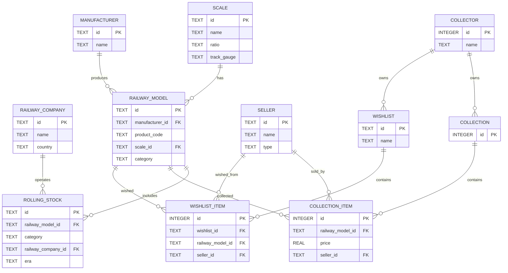

# **RustHouse: Requirements**

## **1. Introduction**

### **1.1 Purpose**

The purpose of **RustHouse** is to provide model railway collectors with a desktop tool to organize their collections and wish lists, record detailed information about models and rolling stock, and track purchase details.

### **1.2 Scope**


RustHouse will be a **GTK4-based desktop application** running on Linux and Windows. It will enable users to:

* Manage a personal collection.
* Manage multiple wish lists.
* Record detailed model and rolling stock information.
* Track purchase information for items in the collection.
* Define and manage railway consist sheets (train formations), including the sequence and details of rolling stock in a train at a given time.
* Search, filter, and sort entries.
* Import/export data in common formats.

RustHouse **will not** include online marketplace integration, payment processing, or cloud synchronization in the initial release.

### **1.3 Definitions, Acronyms, and Abbreviations**

* **GTK4** – GIMP Toolkit, version 4 (GUI framework for Linux desktop applications)
* **ModelProduct** – A product made by a manufacturer, identified by its product code, scale, and details.
* **Rolling Stock** – Individual railway items (locomotive, freight car, passenger car) that make up a model.
* **Collection** – The set of models owned by a collector.
* **Wish List** – A named list of models the collector wants to acquire.
* **Railway Company** – The real-world railway operator or company that the model or rolling stock represents (e.g., DB, SNCF, Amtrak).
* **Scale** – The proportional ratio between the model's size and the real-world object it represents (e.g., HO, N, O, Z).
* **Set** – A group of models or rolling stock items packaged and sold together as a single product (e.g., starter sets, train packs).
* **Consist** – A formation or lineup of rail vehicles (locomotives, passenger cars, or freight cars) that make up a train at a given time. In RustHouse, a Consist sheet records the sequence, composition, and details of rolling stock in a train, including name, era, year(s) of operation, route, and rolling stock details.

## **2. Overall Description**

### **2.1 Product Perspective**

RustHouse is a **standalone desktop application** with local data storage using SQLite. The application’s main view will allow quick switching between the **Collection** and **Wish Lists**.

### **2.2 User Characteristics**

* **Primary User**: Model railway collector.
* Skills: Basic desktop software usage and knowledge of model railway terminology.
* Expected data volume: 50–5,000 models.

### **2.3 Constraints**

* Runs on Linux and Windows with the GTK4 runtime installed.
* Local storage only (no online sync in v1).
* All data in UTF-8 encoding.
* The application must be packaged for distribution using Flatpak or Snap on Linux, and as a standalone installer or portable executable on Windows to ensure easy installation and sandboxing.

### **2.4 Assumptions and Dependencies**

* The user has GTK4 installed on their system.
* SQLite database file is stored in the user’s home directory (e.g., `~/.local/share/rusthouse/rusthouse.sqlite` on Linux, `%USERPROFILE%\\AppData\\Local\\rusthouse\\rusthouse.sqlite` on Windows).
* Optional CSV import/export requires basic knowledge of CSV files.

### **2.5 UX Requirements**

The application UI is structured into three main areas, each with a clear purpose:

- **Header bar**: Provides access to global actions and application-wide controls. Always visible at the top of the window.
- **Sidebar**: Serves as the primary navigation, allowing users to move between major sections of the app.
- **Content area**: Displays the details and management interfaces for the selected section or item.

**Interaction principles:**
- The sidebar helps users navigate to the desired section.
- The header bar offers quick access to global actions, regardless of the current view.
- The content area is focused on managing, editing, and viewing details.

#### **2.5.1 The header bar**

The header bar gives users quick access to global actions without cluttering navigation. 

Header Bar (Top of App Window)
* **Left side (branding / identity)**
  * App logo + name → anchors orientation (e.g., RustHouse).
* **Center (navigation / context)**
  * Page title / breadcrumb → dynamically updates (e.g., Collection › Rolling Stock › Locomotives).
  * Optional: search input field (quick search by model name, type, or decoder address).
* **Right side (global actions)**
  * ➕ Add button (primary action) → main entry point for adding items:
  * Dropdown / split button:
    * Add Rolling Stock
    * Add Accessory
    * Add to Wishlist

The header bar follows GNOME HIG conventions for application top bars:

- **Left (App Identity):**
  - Application icon and name, providing orientation and branding.
- **Center (Context):**
  - Page title or breadcrumb, updating dynamically to reflect the current view (e.g., “Collection › Rolling Stock › Locomotives”).
  - (Optional) Search field for quick filtering by model name, type, or decoder address.
- **Right (Global Actions):**
  - **Add** button (primary action), using a GNOME-style button with a drop-down menu for:
    - Add Rolling Stock
    - Add Accessory
    - Add to Wishlist
    - Add Consist
- **Notifications** (bell icon), for maintenance reminders, wishlist alerts, or digitalization notices.
- **Preferences/About** (gear or menu icon), opening a GNOME-compliant preferences dialog.

**Adding Models:**
- The global “Add” button is always visible in the header bar, opening a modal dialog for adding new items. The dialog is context-aware (e.g., preselects “Add to Wishlist” if viewing a wishlist).
- Contextual add actions are also available within sections (e.g., “Add Locomotive” in Rolling Stock, “Add to this Wishlist” in Wishlists, “Create Consist” in Consists), following GNOME’s principle of providing actions close to where they are needed.

**Accessibility and Consistency:**
- All header bar actions must be accessible via keyboard and screen reader.
- Use standard GNOME icons and button styles for clarity and consistency.

**Design Rationale:**
- The header bar provides global actions and context, always accessible from any view.

**Sidebar Navigation**

* 🏠 **Dashboard**
  * Overview
  * Recent Activity
* 📂 **Collection**
  * Rolling Stock
    * Locomotives
    * Wagons / Cars
    * Maintenance Logs (per item)
    * Digitalization Info (decoder installed, address, type)
  * Accessories
    * Tracks
    * Digital Decoders
    * Scenery
* ⭐ **Wish Lists**
  * Wishlist 1
  * Wishlist 2
  * … (user-defined multiple lists)
* 🚆 **Consists (Train Formations)**
  * All Consists
  * Create New Consist
  * Edit Consist
* 🔍 **Search / Filter**
  * Search by Name, Type, Decoder Address
  * Filter by Maintenance Status, Ownership Status, Digitalization Status
* 📊 **Reports / Stats**
  * Collection Value
  * Maintenance Schedule
  * Digitalization Overview
* ⚙️ **Settings**
  * Preferences
  * Import / Export

The sidebar uses a GNOME-style navigation panel, providing clear, accessible access to all major sections:
- **Dashboard**: Overview of collection statistics and recent activity.
- **Collection**: Access to all owned items, with sub-sections for Rolling Stock, Locomotives, Wagons/Cars, Maintenance Logs, and Digitalization Info.
- **Accessories**: Tracks, Digital Decoders, Scenery.
- **Wish Lists**: User-defined lists for planned acquisitions.
- **Consists**: Train formations, with options to view, create, or edit consists.
- **Search/Filter**: Global search and filtering tools.
- **Reports/Stats**: Collection value, maintenance schedule, digitalization overview.
- **Settings**: App preferences, import/export, and other configuration.

**Sidebar Design Principles:**
- Top-level navigation items use both icons and labels for clarity, following GNOME HIG.
- Expandable submenus are used for detailed navigation, but limited to two levels to avoid complexity.
- When collapsed, the sidebar shows only icons; labels appear on hover or when expanded.
- Frequent actions (Collection, Wish Lists, Consists) are placed at the top; supportive tools (Search, Reports) in the middle; Settings at the bottom, separated by a divider.
- Use standard GNOME icons and visual hierarchy (bold section headers, background tints for grouping).
- All navigation and actions are accessible via keyboard and screen reader.
- Badge counters (e.g., maintenance due) may be shown for quick status.

**Interaction and Accessibility:**
- Sidebar navigation is always visible and can be collapsed for a compact view.
- Section headers and expandable submenus follow GNOME conventions for grouping and indentation.
- Settings are visually separated at the bottom, following GNOME’s standard layout.

**Rationale:**
- The sidebar reflects the main mental models of the app, using clear labels for domain-specific sections and icons for universal actions, in line with GNOME HIG best practices.

### **2.6 Data Seeding for Scales and Railway Companies**

* The application must not require the user to manually create or edit scales or railway companies.
* At startup, the application must seed the database with a predefined list of scales and railway companies, read from a data set in the **Avro** format bundled with the application binary.
* The seeding logic must:
  * Insert a scale or railway company if it is missing from the database.
  * Do nothing if the entity exists and its version matches the seed data.
  * Update the entity if it exists but has an older version than the seed data.
* The seed data file must be maintained as part of the application source and included in all builds and distributions.

#### **2.6.1 Advantages of using Avro over text-based formats (e.g., JSON)**

* Avro is a compact, binary format, resulting in smaller file sizes and faster read/write operations.
* Avro enforces a strict schema, ensuring data consistency and validation at both read and write time.
* Schema evolution is supported, allowing the data structure to change over time without breaking compatibility.
* Binary encoding reduces parsing errors and improves performance compared to text-based formats.
* Avro is widely supported in data processing tools and languages, making integration and future automation easier.
* This ensures all users have a consistent, up-to-date set of scales and railway companies, and prevents accidental user modification or deletion of these core entities.

## **3. Functional Requirements**

### **3.1 Data Entities**

- **Manufacturer:** Describes a company that produces model railway items. Includes company details, contact information, and business status. **ID format:** `urn:manufacturer:{name}` (URL-encoded).

- **Railway Company:** Describes a real-world railway company, including its name, country, status, and contact information. **ID format:** `urn:railway:{name}` (URL-encoded).

- **Scale:** Defines the modeling scale (e.g., H0, N, Z) and associated properties such as ratio and track gauge. **ID format:** `urn:scale:{name}` (URL-encoded).

- **RailwayModel:** Represents a product made by a manufacturer, which may be a single item or a set (e.g., starter sets, train packs). A RailwayModel is a container for one or more rolling stock items. Each RailwayModel is uniquely identified by its product code and manufacturer, and can represent either an individual item (such as a locomotive or car) or a packaged set of multiple rolling stock. 

  Key properties:

    * Unique identifier (URN: `urn:model:{manufacturer name}-{product code}` URL-encoded)
    * Manufacturer — the company that produced the model
    * Product code — the manufacturer’s product or catalogue code
    * Name — the name or title of the model or set
    * Description — a short description
    * Detailed description — optional, rich text
    * Scale — the modeling scale (e.g., H0, N, Z)
    * Power method — AC, DC, or Trix express
    * Category — Locomotive, Freight Car, Passenger Car, Electric Multiple Unit, Railcar, Train Set, or Starter Set
    * Release year — optional, year of release
    * Delivery date — optional, month or quarter
    * Delivery state — Announced, Available, Cancelled, or Unknown
    * Status — optional, e.g., Active, Discontinued
    * Creation date — when the model was created (ISO 8601)
    * Last modified date — last change (ISO 8601, optional)
    * Version — integer for schema/data versioning

  Each RailwayModel contains one or more Rolling Stock items, which define the actual physical items included (for both individual railway models and sets). All rolling stock for a railway model share the same power method and scale. Sets are represented as RailwayModels with the appropriate category (e.g., Train Set, Starter Set) and multiple associated rolling stock.

- **Rolling Stock:** Represents an individual railway item (locomotive, freight car, passenger car, electric multiple unit, or railcar) that is part of a model. Includes details like category, railway company, and physical attributes. The rolling stock category can be one of: locomotive, freight car, passenger car, electric multiple unit, or railcar. **ID format:** `urn:rollingstock:{model_urn}-{road_number}` (URL-encoded).

  - For **locomotives**, **railcars**, and **electric multiple units**: includes type (for locomotives: diesel, steam, electric; for railcars and EMUs: power car, trailer car), depot name, livery, series, control (no DCC, DCC ready, DCC fitted, DCC sound), and socket type (one of: NONE, NEM_355, NEM_356, NEM_357, NEM_359, NEM_360, NEM_362, NEM_365) for digital decoder. Also includes coupler properties: whether the model mounts a close coupler (`has_close_coupler`), has a standard coupler socket (`has_standard_coupler_socket`), or has a digital controller coupler (`has_digital_controller_coupler`).
  - For **locomotives**, **railcars**, and **electric multiple units**: `dummy` (boolean, true if the item is non-motorized/dummy, false if powered).
  - For **passenger cars**: includes passenger car type (one of: baggage cars, combine cars, compartment coaches, dining cars, double deckers, driving trailers, lounges, observation cars, open coaches, railway post offices, sleeping cars), livery, and service level (first class, second class, third class).
  - For **freight cars**: includes freight car type (one of: auto transport cars, brake wagons, container cars, covered freight cars, deep well flat cars, dump cars, gondolas, heavy goods wagons, hinged cover wagons, hopper wagons, refrigerator cars, silo container cars, slide tarpaulin wagons, sliding wall boxcars, special transport cars, stake wagons, swing roof wagons, tank cars, telescope hood wagons) and livery.
  - For all rolling stock: optional body shell type and chassis type (allowed values: metal die cast, plastic).

- **Seller:** Represents an entity from which a model or set can be purchased. A seller can be either a Shop (retailer/vendor) or a Private Collector. Each seller has a type (`shop` or `collector`), a unique ID, and relevant contact/location details. This allows tracking purchases from both shops and private individuals. **ID format:** `urn:seller:{type}:{name}` (URL-encoded).

- **Favourite Shops:** Represents the user's preferred shops for purchases, allowing quick access and management. Each collector can have multiple favourite shops.

- **Favourite Scales:** Links a collector to their preferred modeling scales. Each record associates a collector with a scale (e.g., H0, N, Z). Main properties: `id`, `collector_id` (FK), `scale_id` (FK), `created_at`.

- **Favourite Railway Companies:** Links a collector to their preferred railway companies. Each record associates a collector with a railway company (e.g., DB, SNCF, Amtrak). Main properties: `id`, `collector_id` (FK), `railway_company_id` (FK), `created_at`.

- **Collector:** Represents the owner of the collection and wish lists. Each collector manages a single personal collection and can create multiple wish lists. Collectors can define preferences such as preferred currency, system of measure, favourite scales, favourite railway companies, and favourite eras.

- **Collection & Collection Items:** The collection is the set of railway models and sets owned by the collector. Each collection item records ownership details, purchase information, and links to either a railway model or a set, as well as the shop. Main properties: `id`, `collection_id` (FK), `item_type` (RailwayModel or Set), `item_id` (FK to RailwayModel or Set), `purchase_date`, `purchase_price`, `currency`, `vendor`, `condition`, `notes`, `quantity`.

- **Wish List & Wish List Items:** Wish lists are named lists of railway models and sets the collector wants to acquire. Each wish list item records a desired railway model or set, optional target price, and shop, and is linked to a specific wish list. Main properties: `id`, `wishlist_id` (FK), `item_type` (RailwayModel or Set), `item_id` (FK to RailwayModel or Set), `target_price`, `shop_id` (optional), `notes`. **Wish List ID format:** `urn:wishlist:{name}` (URL-encoded).


- **Consist:** Represents a formation or consist sheet, defining the lineup of rail vehicles (locomotives, passenger cars, or freight cars) that make up a train at a given time. Each consist records:

  Key properties:
  * Unique identifier (URN: `urn:consist:{name}` URL-encoded)
  * Name — the name of the consist (e.g., "Orient Express")
  * Era — the era or epoch (e.g., III, IV, V)
  * Year started — the year when the consist was first run
  * Year ended — the year when the consist was last run (or null for a single year)
  * Route origin — the starting location (e.g., Paris)
  * Route destination — the destination location (e.g., Istanbul)
  * Description — optional description
  * Creation date — when the consist was created (ISO 8601)
  * Last modified date — last change (ISO 8601, optional)
  * Version — integer for schema/data versioning
  * Rolling stock — ordered list of rolling stock items in the consist. For each rolling stock:
    - Category — locomotive, passenger car, or freight car
    - Subcategory — e.g., postal car, sleeper, diner, etc.
    - Service level — for passenger cars
    - Road name and road number
    - Notes — optional

- **Maintenance Card**: Represents the maintenance and digital setup record for each model or rolling stock item. It centralizes all information related to the upkeep and digital configuration of an item, supporting both operational tracking and historical reference.

  Key attributes:
  - Maintenance status (e.g., up to date, due, overdue)
  - Last and next scheduled maintenance dates
  - Complete maintenance history (date, type, notes, performed by)
  - Digital setup details (decoder installed, manufacturer, model, address, installation date, features)

  The Maintenance Card enables users to view, edit, and track all maintenance and digitalization activities for their collection, ensuring timely upkeep and accurate documentation of digital configurations. It is accessible from the model/rolling stock detail view and provides reminders and status indicators in collection and depot overviews.

### **3.2 Features**

#### **3.2.1 RailwayModel & Rolling Stock Management**

* Create/Edit/Delete railway models.
* Add one or more rolling stocks per railway model.
* Manage rolling stock attributes.

#### **3.2.2 Collection Management**

* Add/Edit/Delete collection railway models.
* Record purchase details (price, shop).
* Search and filter collection entries.
* Manage a list of favourite shops for quick access when adding or editing collection items.

#### **3.2.3 Wish List Management**

* Create/Delete wish lists.
* Add/Edit/Delete wish list items.
* Move items from wish list to collection.

#### **3.2.4 Rolling Stocks Management**

* View a list of all rolling stock items owned by the collector, across all models and sets
* For each rolling stock item, display key technical information, including:
  * Whether a digital decoder is installed (and type, if available).
  * Maintenance status or reminders if the item is due for maintenance.
* Filter and search the depot by category, scale, or technical attributes.
* Quickly identify which items need attention or upgrades.

#### **3.2.5 Viewing & Filtering**

* Sort by manufacturer, category, scale, era, or price.
* Filter by wish list, category, or railway company.
* Search by product code or description.

#### **3.2.6 Shop Management**

* Add/Edit/Delete shops.
* View all shops in the system.
* Mark or unmark shops as favourites.

#### **3.2.7 Collector Preferences**

* Set and update preferred currency.
* Set and update preferred system of measure (mm or inches).
* Manage a list of favourite scales.
* Manage a list of favourite railway companies.
* Manage a list of favourite eras.
* Access and modify all preferences via a dedicated settings widget in the application.

#### **3.2.8 Consist (Train Formation) Management**

* Create/Edit/Delete consist sheets (train formations).
* Define consist properties: name, era, year(s) of operation, route (origin/destination), and description.
* Add, remove, and reorder rolling stock in a consist, specifying for each:
  * Category (locomotive, passenger car, freight car)
  * Subcategory (e.g., postal car, sleeper, diner, etc.)
  * Service level (for passenger cars)
  * Road name and number
  * Notes (optional)
* View and search all defined consists.
* View details of a consist, including the ordered list of rolling stock.
* Duplicate an existing consist as a template for a new one.

#### **3.2.9 Import/Export**

* Export collection or wish lists to CSV/JSON.
* Import models from CSV (optional in v1).

## **4. Non-Functional Requirements**

### **4.1 Performance**

* Search/filter results in under 1 second for up to 5,000 models.

### **4.2 Reliability**

* Local database integrity checks on startup.
* Auto-save on data modification.

### **4.3 Usability**

* GTK4-based interface with clear navigation.
* Keyboard shortcuts for common actions.

### **4.4 Maintainability**

* Modular code structure for adding new attributes.
* Separation between UI and data logic.

### **4.5 Security**

* User data stored locally in SQLite file with file system permissions.

## **5. User Stories**

### **5.1 Collection Management**
* As a collector
  I want to add models and sets to my collection
  So that I can keep track of what I own and their purchase details.
* As a collector
  I want to edit or remove items from my collection
  So that my collection stays accurate and up to date.
* As a collector
  I want to search and filter my collection by manufacturer, category, scale, or price
  So that I can quickly find specific items.

### **5.2 Wish List Management**
* As a collector
  I want to create and manage wish lists of railway models and sets
  So that I can plan future purchases and track desired items.
* As a collector
  I want to move items from a wish list to my collection
  So that I can record when I acquire something I wanted.

### **5.3 RailwayModel & Rolling Stock Management**
* As a collector
  I want to add, edit, or remove railway models and their rolling stock
  So that my collection reflects all the details of each item.

### **5.4 Depot Management**
* As a collector
  I want to view a list of all rolling stock I own in one place
  So that I can easily see and manage my entire inventory.
* As a collector
  I want to see technical information for each rolling stock item, such as decoder installation and maintenance status
  So that I can keep my collection in good working order and plan upgrades or repairs.
* As a collector
  I want to filter or search by technical attributes (e.g., decoder type, maintenance needed)
  So that I can quickly find items that need attention or have specific features.

### **5.5 Maintenance Cards**
* As a collector
  I want to view the maintenance status and history for each model or rolling stock item
  So that I can keep track of when maintenance was last performed and what was done.
* As a collector
  I want to add, edit, or remove maintenance events for my models and rolling stock
  So that I can accurately document all upkeep and repairs.
* As a collector
  I want to receive reminders when maintenance is due or overdue
  So that I can ensure my collection remains in good condition.
* As a collector
  I want to record digital setup details (such as decoder installation and address)
  So that I have a complete technical record for each item in my collection.

### **5.6 Consist (Train Formation) Management**
* As a collector
  I want to create and manage consist sheets (train formations)
  So that I can document and plan the composition of trains for my collection or operations.
* As a collector
  I want to add, remove, and reorder rolling stock in a consist
  So that I can accurately represent the sequence and makeup of a train.
* As a collector
  I want to specify details for each rolling stock in a consist (category, subcategory, service level, road name/number)
  So that my consist sheets are detailed and historically accurate.
* As a collector
  I want to duplicate an existing consist as a template
  So that I can quickly create similar train formations with minor changes.

### **5.7 Shop Management**
* As a collector
  I want to add, edit, or remove shops
  So that I can track where I buy or want to buy items.
* As a collector
  I want to mark shops as favourites
  So that I can quickly select them when adding collection or wish list items.

### **5.8 Preferences**
* As a collector
  I want to set my preferred currency, measurement system, favourite scales, railway companies, and eras
  So that the app matches my personal collecting interests.

### **5.9 Import/Export**
* As a collector
  I want to export my collection or wish lists to CSV or JSON
  So that I can back up or share my data.
* As a collector
  I want to import models from CSV
  So that I can quickly add many items at once.

## 6 Enumerations

### 6.1 Seller Type
* Name: Seller Type
* Description: The type of seller entity from which a model or set can be purchased.
* Values:
  * `SHOP` – Retailer or commercial seller
  * `COLLECTOR` – Private individual or hobbyist

### 6.2 Track Gauge
* Name: Track Gauge
* Description: The type of track gauge for a scale.
* Values:
  * `STANDARD` – Standard gauge track
  * `NARROW` – Narrow gauge track

### 6.3 Railway Company Status
* Name: Railway Company Status
* Description: The operational status of a railway company.
* Values:
  * `ACTIVE` – Currently operating
  * `INACTIVE` – No longer operating

### 6.4 Manufacturer Kind
* Name: Manufacturer Kind
* Description: The kind of manufacturer.
* Values:
  * `INDUSTRIAL` – Mass-market manufacturer
  * `BRASS_METAL_MODELS` – Specialist, often hand-built models

### 6.5 Manufacturer Status
* Name: Manufacturer Status
* Description: The operational status of a manufacturer.
* Values:
  * `ACTIVE` – Company is in business
  * `OUT_OF_BUSINESS` – Company has ceased operations

### 6.6 Delivery State
* Name: Delivery State
* Description: The delivery state of a railway model.
* Values:
  * `ANNOUNCED` – Model announced, not yet available
  * `AVAILABLE` – Model is available for purchase
  * `CANCELLED` – Model was cancelled
  * `UNKNOWN` – Status not specified

### 6.7 Power Method
* Name: Power Method
* Description: The power method used by a railway model.
* Values:
  * `AC` – Alternating current power
  * `DC` – Direct current power
  * `TRIX_EXPRESS` – Trix Express system

### 6.8 Model Category
* Name: Model Category
* Description: The category of a railway model.
* Values:
  * `LOCOMOTIVE` – Self-propelled engine
  * `FREIGHT_CAR` – Car for goods or cargo
  * `PASSENGER_CAR` – Car for passengers
  * `ELECTRIC_MULTIPLE_UNIT` – Self-propelled electric trainset
  * `RAILCAR` – Self-propelled single car
  * `TRAIN_SET` – Boxed set of multiple cars/locos
  * `STARTER_SET` – Beginner's set with track and controller

### 6.9 Rolling Stock Category
* Name: Rolling Stock Category
* Description: The category of a rolling stock item.
* Values:
  * `LOCOMOTIVE` – Self-propelled engine
  * `FREIGHT_CAR` – Car for goods or cargo
  * `PASSENGER_CAR` – Car for passengers
  * `ELECTRIC_MULTIPLE_UNIT` – Self-propelled electric trainset
  * `RAILCAR` – Self-propelled single car

### 6.10 Locomotive Type
* Name: Locomotive Type
* Description: The type of locomotive.
* Values:
  * `DIESEL_LOCOMOTIVE` – Powered by diesel engine
  * `STEAM_LOCOMOTIVE` – Powered by steam engine
  * `ELECTRIC_LOCOMOTIVE` – Powered by electric motor
  * `SHUNTING_LOCOMOTIVE` – For yard/switching duties

### 6.11 Railcar
* Name: Railcar Type
* Description: The type of railcar.
* Values:
  * `POWER_CAR` – Motorized car in a trainset
  * `TRAILER_CAR` – Non-powered car in a trainset

### 6.12 EMU Type
* Name: EMU Type
* Description: The type of electric multiple unit.
* Values:
  * `DRIVING_CAR` – Car with driver's cab, controls train but may not be powered
  * `HIGH_SPEED_TRAIN` – EMU designed for high-speed service
  * `MOTOR_CAR` – Powered car with traction motors
  * `POWER_CAR` – Main powered car in the EMU
  * `TRAILER_CAR` – Non-powered car, no traction motors
  * `TRAIN_SET` – Complete EMU set, may include multiple car types

### 6.13 Control
* Name: Control
* Description: The digital control capability of a model.
* Values:
  * `NO_DCC` – No digital decoder, analog only
  * `DCC_READY` – Prepared for DCC, socket for decoder
  * `DCC_FITTED` – Digital decoder installed
  * `DCC_SOUND` – Digital decoder with sound functions

### 6.14 Socket Type
* Name: Socket Type
* Description: The type of NEM digital decoder socket for DCC or digital control, as per NEM standards.
* Values:
  * `NEM_651` – 6-pin, small scale
  * `NEM_652` – 8-pin, standard
  * `NEM_654` – 21-pin, PluX
  * `NEM_658` – 22-pin, PluX22
  * `NEM_660` – 21MTC
  * `NEXT18` – Next18 socket
  * `WIRE` – Hardwired
  * `NONE` – No socket

### 6.15 Passenger Car Type
* Name: Passenger Car Type
* Description: The type of passenger car.
* Values:
  * `BAGGAGE_CAR` – Car for luggage and parcels
  * `COMBINE_CAR` – Car combining passenger and baggage sections
  * `COMPARTMENT_COACH` – Coach with individual compartments
  * `DINING_CAR` – Car with restaurant or dining facilities
  * `DOUBLE_DECKER` – Two-level passenger car
  * `DRIVING_TRAILER` – Passenger car with driver's cab (no engine)
  * `LOUNGE` – Car with lounge or observation seating
  * `OBSERVATION_CAR` – Car with panoramic windows, often at train end
  * `OPEN_COACH` – Coach with open seating (no compartments)
  * `RAILWAY_POST_OFFICE` – Car for mail sorting and transport
  * `SLEEPING_CAR` – Car with beds or sleeping compartments

### 6.16 Service Level
* Name: Service Level
* Description: The service level of a passenger car.
* Values:
  * `FIRST_CLASS` – Premium passenger accommodation
  * `MIXED_FIRST_SECOND_CLASS` – Both first and second class
  * `SECOND_CLASS` – Standard passenger accommodation
  * `MIXED_SECOND_THIRD_CLASS` – Both second and third class
  * `THIRD_CLASS` – Basic passenger accommodation

### 6.17 Freight Car Type
* Name: Freight Car Type
* Description: The type of freight car.
* Values:
  * `AUTO_TRANSPORT_CAR` – For transporting automobiles
  * `BRAKE_WAGON` – Equipped with handbrake, often for train end
  * `CONTAINER_CAR` – Carries shipping containers
  * `COVERED_FREIGHT_CAR` – Enclosed car for general goods
  * `DEEP_WELL_FLAT_CAR` – Low-floor car for tall/large loads
  * `DUMP_CAR` – For bulk materials, can tip to unload
  * `GONDOLA` – Open-topped car for bulk goods
  * `HEAVY_GOODS_WAGON` – For very heavy or oversized cargo
  * `HINGED_COVER_WAGON` – Covered car with hinged roof for loading
  * `HOPPER_WAGON` – For bulk goods, unloads from bottom
  * `REFRIGERATOR_CAR` – Insulated, for perishable goods
  * `SILO_CONTAINER_CAR` – For powders or granules, with silo containers
  * `SLIDE_TARPAULIN_WAGON` – Covered with sliding tarpaulin for easy access
  * `SLIDING_WALL_BOXCAR` – Boxcar with sliding walls for loading
  * `SPECIAL_TRANSPORT_CAR` – For special or unusual loads
  * `STAKE_WAGON` – Flat car with stakes for logs or pipes
  * `SWING_ROOF_WAGON` – Roof swings open for loading/unloading
  * `TANK_CAR` – For liquids or gases
  * `TELESCOPE_HOOD_WAGON` – Covered car with telescoping hood for coils or sheet metal

### 6.19 Body Shell
* Name: Body Shell
* Description: The material type for body shell.
* Values:
  * `METAL_DIE_CAST` – Made from metal die casting
  * `PLASTIC` – Made from plastic

### 6.20 Chassis Type
* Name: Chassis Type
* Description: The material type for chassis.
* Values:
  * `METAL_DIE_CAST` – Made from metal die casting
  * `PLASTIC` – Made from plastic

### 6.21 Priority
* Name: Priority
* Description: The priority of a wish list item.
* Values:
  * `HIGH` – Highest priority
  * `NORMAL` – Normal priority
  * `LOW` – Lowest priority

### 6.22 Epoch
* Name: Epoch
* Description: The historical railway era or epoch classification for rolling stock and models.
* Values:
  * `I` – Early railways (approx. 1835–1920)
  * `II` – Grouping and nationalization (approx. 1920–1945)
  * `IIa` – Early part of Epoch II
  * `IIb` – Later part of Epoch II
  * `III` – Postwar, steam/diesel transition (approx. 1945–1970)
  * `IIIa` – Early part of Epoch III
  * `IIIb` – Later part of Epoch III
  * `IV` – Modernization, UIC numbering (approx. 1970–1990)
  * `IVa` – Early part of Epoch IV
  * `IVb` – Later part of Epoch IV
  * `V` – Privatization, new liveries (approx. 1990–2006)
  * `Vm` – Modern sub-epoch of V
  * `VI` – Contemporary era (approx. 2007–present)

### 6.23 Coupler Socket Type
* Name: Coupler Socket Type
* Description: The type of coupler socket, following NEM standards for model railway couplers.
* Values:
  * `NEM_355` – Coupler pocket for Z scale (1:220)
  * `NEM_356` – Coupler pocket for N scale (1:160)
  * `NEM_357` – Coupler pocket for TT scale (1:120)
  * `NEM_358` – Coupler pocket for H0e/H0m narrow gauge
  * `NEM_359` – Coupler pocket for H0 scale (1:87), standard
  * `NEM_360` – Coupler pocket for O scale (1:45)
  * `NEM_361` – Coupler pocket for 1 scale (1:32)
  * `NEM_362` – Universal close coupler pocket (widely used in H0)
  * `NEM_363` – Coupler pocket for G scale (1:22.5)
  * `NEM_365` – Coupler pocket for narrow gauge and special applications

### 6.24 Consist Type
* Name: Consist Type
* Description: The type of train formation represented by a consist.
* Values:
  * `HIGH_SPEED_TRAIN` – High speed train consist
  * `PASSENGER_TRAIN` – Passenger train consist
  * `FREIGHT_TRAIN` – Freight train consist

### 6.25 Maintenance Status
* Name: Maintenance Status
* Description: The current maintenance state of a model or rolling stock item.
* Values:
  * `UP_TO_DATE` – Maintenance is up to date
  * `DUE` – Maintenance is due
  * `OVERDUE` – Maintenance is overdue
  * `UNKNOWN` – Maintenance status is unknown

### 6.26 Maintenance Type
* Name: Maintenance Type
* Description: The type of maintenance activity performed on a model or rolling stock item.
* Values:
  * `CLEANING` – Cleaning of the model or rolling stock
  * `LUBRICATION` – Lubrication of moving parts
  * `REPAIR` – Repair of faults or damage
  * `INSPECTION` – Routine inspection
  * `UPGRADE` – Upgrade or replacement of components
  * `OTHER` – Other maintenance activity

## **7. E/R Model**



## **8. Database Schema**

```sql
Collector(
    id INTEGER PRIMARY KEY,
    name TEXT NOT NULL,
    preferred_currency TEXT,           -- ISO 4217 currency code (e.g., EUR, USD)
    preferred_measure TEXT             -- 'mm' or 'inches'
)

Scale(
  id TEXT PRIMARY KEY,                  -- URN: urn:scale:{name}
    name TEXT NOT NULL,                 -- e.g., H0, N, Z, O, G
    ratio TEXT NOT NULL,                -- e.g., 1:87, 1:160
    track_gauge TEXT NOT NULL,          -- enum: Standard, Narrow
    gauge_mm REAL NOT NULL,             -- mm
    gauge_in REAL NOT NULL,             -- inches
    description TEXT,                   -- optional
    created_at TEXT NOT NULL,           -- creation timestamp (ISO 8601)
    last_modified_at TEXT,              -- last change timestamp (ISO 8601, optional)
    version INTEGER NOT NULL DEFAULT 1
)

RailwayCompany(
    id TEXT PRIMARY KEY,                -- URN: urn:railway:{name}
    name TEXT NOT NULL,
    registered_company_name TEXT,       -- optional
    country TEXT NOT NULL,              -- ISO 3166-1 alpha-2 country code
    status TEXT NOT NULL,               -- enum: Active, Inactive
    website_url TEXT,                   -- optional
    linkedin TEXT,                      -- optional
    facebook TEXT,                      -- optional
    twitter TEXT,                       -- optional
    instagram TEXT,                     -- optional
    youtube TEXT,                       -- optional
    description TEXT,                   -- optional
    created_at TEXT NOT NULL,           -- creation timestamp (ISO 8601)
    last_modified_at TEXT,              -- last change timestamp (ISO 8601, optional)
    version INTEGER NOT NULL DEFAULT 1
)

Manufacturer(
    id TEXT PRIMARY KEY,                -- URN: urn:manufacturer:{name}
    name TEXT NOT NULL,
    registered_company_name TEXT,       -- optional
    kind TEXT,                          -- enum: Industrial, Brass Metal Models
    status TEXT,                        -- enum: Active, Out of Business
    email TEXT,                         -- optional
    website_url TEXT,                   -- optional
    phone_number TEXT,                  -- optional
    street_address TEXT,                -- optional
    city TEXT,                          -- optional
    state TEXT,                         -- optional
    postal_code TEXT,                   -- optional
    country TEXT,                       -- optional, ISO 3166-1 alpha-2 country code
    linkedin TEXT,                      -- optional
    facebook TEXT,                      -- optional
    twitter TEXT,                       -- optional
    instagram TEXT,                     -- optional
    youtube TEXT,                       -- optional
    created_at TEXT NOT NULL,           -- creation timestamp (ISO 8601)
    last_modified_at TEXT,              -- last change timestamp (ISO 8601, optional)
    version INTEGER NOT NULL DEFAULT 1
)

RailwayModel(
    id TEXT PRIMARY KEY,          -- URN: urn:railwaymodel:{manufacturer name}-{product code}
    manufacturer_id TEXT NOT NULL REFERENCES Manufacturer(id),
    product_code TEXT NOT NULL,
    description TEXT NOT NULL,
    detailed_description TEXT,    -- optional, rich text
    delivery_date TEXT,           -- optional, month or quarter
    delivery_state TEXT,          -- enum: Announced, Available, Cancelled, Unknown
    scale_id TEXT NOT NULL REFERENCES Scale(id),    
    power_method TEXT NOT NULL,   -- enum: AC, DC, Trix express
    category TEXT NOT NULL,       -- enum: Locomotive, Freight Car, Passenger Car, Electric Multiple Unit, Railcar, Train Set, Starter Set
    created_at TEXT NOT NULL,     -- creation timestamp (ISO 8601)
    last_modified_at TEXT,        -- last change timestamp (ISO 8601, optional)
    version INTEGER NOT NULL DEFAULT 1
    UNIQUE(manufacturer_id, product_code),
)

RollingStock(
    id TEXT PRIMARY KEY,          -- URN: urn:rollingstock:{railwaymodel_urn}-{road_number} or similar, see note below
    railway_model_id TEXT NOT NULL REFERENCES RailwayModel(id),
    category TEXT NOT NULL,       -- enum: Locomotive, Freight Car, Passenger Car, Electric Multiple Unit, Railcar
    railway_company_id TEXT NOT NULL REFERENCES RailwayCompany(id),
    length_mm REAL,               -- optional
    length_in REAL,               -- optional           
    era TEXT NOT NULL,            -- string/enum
    type_name TEXT NOT NULL,      -- rolling stock type or group name
    road_number TEXT,             -- optional
    description TEXT,             -- optional
    detailed_description TEXT,    -- optional, rich text
    dummy BOOLEAN NOT NULL DEFAULT 0, -- true if non-motorized (dummy), false if powered
    -- Category-specific fields:
    locomotive_type TEXT,         -- enum: Diesel, Steam, Electric (locomotives only)
    depot_name TEXT,              -- locomotives, railcars, EMUs
    livery TEXT,                  -- all categories
    series TEXT,                  -- locomotives, railcars, EMUs
    control TEXT,                 -- enum: No DCC, DCC Ready, DCC Fitted, DCC Sound (locomotives, railcars, EMUs)
    dcc_socket_type TEXT,         -- enum (locomotives, railcars, EMUs)
    coupler_socket_type TEXT,     -- enum: NEM_355, NEM_356, NEM_357, NEM_358, NEM_359, NEM_360, NEM_361, NEM_362, NEM_363, NEM_365
    has_close_coupler BOOLEAN,    -- true if mounts a close coupler
    has_digital_controller_coupler BOOLEAN, -- true if has a digital controller coupler
    min_radius REAL,              -- optional
    railcar_type TEXT,            -- enum: Power Car, Trailer Car (railcars only)
    emu_type TEXT,                -- enum: Power Car, Trailer Car (EMUs only)
    passenger_car_type TEXT,      -- passenger cars only
    service_level TEXT,           -- enum: First Class, Second Class, Third Class (passenger cars only)
    freight_car_type TEXT,        -- freight cars only
    body_shell_type TEXT,         -- enum: metal die cast, plastic (optional, all categories)
    chassis_type TEXT             -- enum: metal die cast, plastic (optional, all categories)
)

Collection(
    id INTEGER PRIMARY KEY,
    collector_id INTEGER NOT NULL REFERENCES Collector(id) UNIQUE,
    name TEXT NOT NULL,
    description TEXT,
    created_at TEXT NOT NULL,      -- ISO 8601 timestamp
    last_modified_at TEXT,         -- ISO 8601 timestamp, optional
    version INTEGER NOT NULL DEFAULT 1
)

CollectionItem(
    id INTEGER PRIMARY KEY,
    collection_id TEXT NOT NULL REFERENCES Collection(id),
    railway_model_id TEXT NOT NULL REFERENCES RailwayModel(id),
    price REAL NOT NULL,          -- numeric, currency
    currency TEXT,                -- optional, ISO 4217 currency code (e.g., EUR, USD)
    seller_id TEXT REFERENCES Seller(id), -- optional, foreign key to Seller (URN)
    added_at TEXT NOT NULL,       -- when added to collection (ISO 8601)
    removed_at TEXT               -- when removed from collection (ISO 8601, optional)
)

WishList(
    id TEXT PRIMARY KEY,               -- URN: urn:wishlist:{name}
    name TEXT NOT NULL,                -- name of the wish list
    description TEXT,                  -- optional
    created_at TEXT NOT NULL,          -- creation timestamp (ISO 8601)
    last_modified_at TEXT,             -- last change timestamp (ISO 8601, optional)
    version INTEGER NOT NULL DEFAULT 1
)

WishListItem(
    id INTEGER PRIMARY KEY,
    wishlist_id TEXT NOT NULL REFERENCES WishList(id),
    railway_model_id TEXT NOT NULL REFERENCES RailwayModel(id),
    desired_price REAL,           -- optional, currency
    currency TEXT,                -- optional, ISO 4217 currency code (e.g., EUR, USD)
    seller_id TEXT REFERENCES Seller(id), -- optional, foreign key to Seller (URN)
    priority TEXT NOT NULL DEFAULT 'NORMAL', -- enum: HIGH, NORMAL, LOW
    added_at TEXT NOT NULL,       -- when added to wishlist (ISO 8601)
    removed_at TEXT               -- when removed from wishlist (ISO 8601, optional)
)

Seller(
    id TEXT PRIMARY KEY,         -- URN: urn:seller:{type}:{name}
    name TEXT NOT NULL,
    type TEXT,                   -- enum: shop, collector
    email TEXT,                  -- optional
    website_url TEXT,            -- optional
    phone_number TEXT,           -- optional
    street_address TEXT,         -- optional
    city TEXT,                   -- optional
    state TEXT,                  -- optional
    postal_code TEXT,            -- optional
    country TEXT,                -- optional, ISO 3166-1 alpha-2 country code
    created_at TEXT NOT NULL,     -- creation timestamp (ISO 8601)
    last_modified_at TEXT,        -- last change timestamp (ISO 8601, optional)
    version INTEGER NOT NULL DEFAULT 1
)

FavouriteSeller(
    id INTEGER PRIMARY KEY,
    collector_id INTEGER NOT NULL REFERENCES Collector(id),
    seller_id TEXT NOT NULL REFERENCES Seller(id),
    created_at TEXT NOT NULL, -- when marked as favourite
    UNIQUE(collector_id, seller_id)
)

FavouriteScale(
    id INTEGER PRIMARY KEY,
    collector_id INTEGER NOT NULL REFERENCES Collector(id),
    scale_id TEXT NOT NULL REFERENCES Scale(id),
    created_at TEXT NOT NULL,
    UNIQUE(collector_id, scale_id)
)

FavouriteRailwayCompany(
    id INTEGER PRIMARY KEY,
    collector_id INTEGER NOT NULL REFERENCES Collector(id),
    railway_company_id TEXT NOT NULL REFERENCES RailwayCompany(id),
    created_at TEXT NOT NULL,
    UNIQUE(collector_id, railway_company_id)
)

FavouriteEra(
    id INTEGER PRIMARY KEY,
    collector_id INTEGER NOT NULL REFERENCES Collector(id),
    era TEXT NOT NULL, -- string/enum, e.g., 'III', 'IV', 'V'
    created_at TEXT NOT NULL,
    UNIQUE(collector_id, era)
)

Consist(
    id TEXT PRIMARY KEY,                -- URN: urn:consist:{name}
    name TEXT NOT NULL,                 -- Name of the consist
    consist_type TEXT NOT NULL,         -- enum: High Speed Train, Passenger Train, Freight Train
    era TEXT NOT NULL,                  -- Era or epoch (e.g., III, IV, V)
    year_start INTEGER,                 -- Year when the consist was first run
    year_end INTEGER,                   -- Year when the consist was last run (or null for a single year)
    route_origin TEXT,                  -- Starting location
    route_destination TEXT,             -- Destination location
    description TEXT,                   -- Optional
    created_at TEXT NOT NULL,           -- ISO 8601 timestamp
    last_modified_at TEXT,              -- ISO 8601 timestamp, optional
    version INTEGER NOT NULL DEFAULT 1
)

ConsistRollingStock(
    id INTEGER PRIMARY KEY,
    consist_id TEXT NOT NULL REFERENCES Consist(id),
    position INTEGER NOT NULL,          -- Order in the consist
    category TEXT NOT NULL,             -- Locomotive, Passenger Car, Freight Car
    subcategory TEXT,                   -- e.g., postal car, sleeper, diner, etc.
    service_level TEXT,                 -- For passenger cars
    road_name TEXT NOT NULL,
    road_number TEXT,                   -- Optional
    notes TEXT                          -- Optional
)

MaintenanceCard(
    id INTEGER PRIMARY KEY,
    model_id TEXT NOT NULL,                 -- FK to RailwayModel(id) or RollingStock(id)
    maintenance_status TEXT NOT NULL,       -- e.g., 'up to date', 'due', 'overdue'
    last_maintenance_date TEXT,             -- ISO 8601
    next_maintenance_date TEXT,             -- ISO 8601, optional
    digital_decoder_installed BOOLEAN,      -- true/false
    decoder_manufacturer TEXT,              -- optional
    decoder_model TEXT,                     -- optional
    decoder_address TEXT,                   -- integer or string
    decoder_installation_date TEXT,         -- optional
    decoder_features TEXT,                  -- optional, e.g., sound, functions
    created_at TEXT NOT NULL,               -- ISO 8601 timestamp
    last_modified_at TEXT,                  -- ISO 8601 timestamp, optional
    UNIQUE(model_id, model_type)
)

MaintenanceEvent(
    id INTEGER PRIMARY KEY,
    maintenance_card_id INTEGER NOT NULL REFERENCES MaintenanceCard(id),
    date_performed TEXT NOT NULL,           -- ISO 8601
    maintenance_type TEXT NOT NULL,         -- e.g., cleaning, lubrication, repair
    notes TEXT,                            -- optional
    performed_by TEXT,                     -- optional (user, shop, etc.)
    created_at TEXT NOT NULL                -- ISO 8601 timestamp
)

```

# **8. Avro Schemas**

## **8.1 Scale**

```avro
{
  "type": "record",
  "name": "Scale",
  "namespace": "io.github.carlomicieli.rusthouse",
  "doc": "Defines the modeling scale (e.g., H0, N, Z) and associated properties.",
  "fields": [
    {
      "name": "id",
      "type": "string",
      "doc": "URN: urn:scale:{name}"
    },
    {
      "name": "name",
      "type": "string",
      "doc": "Scale name, e.g., H0, N, Z, O, G"
    },
    {
      "name": "ratio",
      "type": "string",
      "doc": "Scale ratio, e.g., 1:87, 1:160"
    },
    {
      "name": "track_gauge",
      "type": {
        "type": "enum",
        "name": "TrackGauge",
        "symbols": [
          "STANDARD",
          "NARROW"
        ]
      },
      "doc": "Track gauge type"
    },
    {
      "name": "gauge",
      "type": "double",
      "doc": "Track gauge in mm or inches"
    },
    {
      "name": "description",
      "type": [
        "null",
        "string"
      ],
      "default": null,
      "doc": "Optional description"
    },
    {
      "name": "created_at",
      "type": "string",
      "doc": "Creation timestamp (ISO 8601)"
    },
    {
      "name": "last_modified_at",
      "type": [
        "null",
        "string"
      ],
      "default": null,
      "doc": "Last change timestamp (ISO 8601, optional)"
    },
    {
      "name": "version",
      "type": "int",
      "default": 1,
      "doc": "Schema/data version"
    }
  ]
}
```

## **8.2 Railway Company**

```avro
{
  "type": "record",
  "name": "RailwayCompany",
  "namespace": "io.github.carlomicieli.rusthouse",
  "doc": "Describes a real-world railway company, including its name, country, status, and contact information.",
  "fields": [
    {
      "name": "id",
      "type": "string",
      "doc": "URN: urn:railway:{name}"
    },
    {
      "name": "name",
      "type": "string",
      "doc": "Railway company name"
    },
    {
      "name": "registered_company_name",
      "type": [
        "null",
        "string"
      ],
      "default": null,
      "doc": "Optional registered company name"
    },
    {
      "name": "country",
      "type": "string",
      "doc": "ISO 3166-1 alpha-2 country code"
    },
    {
      "name": "status",
      "type": {
        "type": "enum",
        "name": "RailwayCompanyStatus",
        "symbols": [
          "ACTIVE",
          "INACTIVE"
        ]
      },
      "doc": "Operational status"
    },
    {
      "name": "website_url",
      "type": [
        "null",
        "string"
      ],
      "default": null,
      "doc": "Optional website URL"
    },
    {
      "name": "linkedin",
      "type": [
        "null",
        "string"
      ],
      "default": null,
      "doc": "Optional LinkedIn URL"
    },
    {
      "name": "facebook",
      "type": [
        "null",
        "string"
      ],
      "default": null,
      "doc": "Optional Facebook URL"
    },
    {
      "name": "twitter",
      "type": [
        "null",
        "string"
      ],
      "default": null,
      "doc": "Optional Twitter URL"
    },
    {
      "name": "instagram",
      "type": [
        "null",
        "string"
      ],
      "default": null,
      "doc": "Optional Instagram URL"
    },
    {
      "name": "youtube",
      "type": [
        "null",
        "string"
      ],
      "default": null,
      "doc": "Optional YouTube URL"
    },
    {
      "name": "description",
      "type": [
        "null",
        "string"
      ],
      "default": null,
      "doc": "Optional description"
    },
    {
      "name": "created_at",
      "type": "string",
      "doc": "Creation timestamp (ISO 8601)"
    },
    {
      "name": "last_modified_at",
      "type": [
        "null",
        "string"
      ],
      "default": null,
      "doc": "Last change timestamp (ISO 8601, optional)"
    },
    {
      "name": "version",
      "type": "int",
      "default": 1,
      "doc": "Schema/data version"
    }
  ]
}
```

## **8.3. Railway Model**

```avro
{
  "type": "record",
  "name": "RailwayModel",
  "namespace": "io.github.carlomicieli.rusthouse",
  "doc": "Represents a product made by a manufacturer, which may be a single item or a set (e.g., starter sets, train packs). Includes associated rolling stock information.",
  "fields": [
    {
      "name": "id",
      "type": "string",
      "doc": "URN: urn:model:{manufacturer name}-{product code}"
    },
    {
      "name": "manufacturer_id",
      "type": "string",
      "doc": "Reference to the Manufacturer (URN)"
    },
    {
      "name": "product_code",
      "type": "string",
      "doc": "Manufacturer’s product/catalogue code"
    },
    {
      "name": "name",
      "type": "string",
      "doc": "Name or title of the model or set"
    },
    {
      "name": "description",
      "type": "string",
      "doc": "Short description"
    },
    {
      "name": "detailed_description",
      "type": [
        "null",
        "string"
      ],
      "default": null,
      "doc": "Optional, rich text"
    },
    {
      "name": "scale_id",
      "type": "string",
      "doc": "Reference to the Scale (URN)"
    },
    {
      "name": "power_method",
      "type": {
        "type": "enum",
        "name": "PowerMethod",
        "symbols": [
          "AC",
          "DC",
          "TRIX_EXPRESS"
        ]
      },
      "doc": "Power method used by the model"
    },
    {
      "name": "category",
      "type": {
        "type": "enum",
        "name": "ModelCategory",
        "symbols": [
          "LOCOMOTIVE",
          "FREIGHT_CAR",
          "PASSENGER_CAR",
          "ELECTRIC_MULTIPLE_UNIT",
          "RAILCAR",
          "TRAIN_SET",
          "STARTER_SET"
        ]
      },
      "doc": "Category of the model"
    },
    {
      "name": "release_year",
      "type": [
        "null",
        "int"
      ],
      "default": null,
      "doc": "Optional, year of release"
    },
    {
      "name": "delivery_date",
      "type": [
        "null",
        "string"
      ],
      "default": null,
      "doc": "Optional, month or quarter"
    },
    {
      "name": "delivery_state",
      "type": {
        "type": "enum",
        "name": "DeliveryState",
        "symbols": [
          "ANNOUNCED",
          "AVAILABLE",
          "CANCELLED",
          "UNKNOWN"
        ]
      },
      "doc": "Delivery state"
    },
    {
      "name": "status",
      "type": [
        "null",
        "string"
      ],
      "default": null,
      "doc": "Optional, e.g., Active, Discontinued"
    },
    {
      "name": "created_at",
      "type": "string",
      "doc": "Creation timestamp (ISO 8601)"
    },
    {
      "name": "last_modified_at",
      "type": [
        "null",
        "string"
      ],
      "default": null,
      "doc": "Last change timestamp (ISO 8601, optional)"
    },
    {
      "name": "version",
      "type": "int",
      "default": 1,
      "doc": "Schema/data version"
    },
    {
      "name": "rolling_stock",
      "type": {
        "type": "array",
        "items": {
          "type": "record",
          "name": "RollingStock",
          "fields": [
            {
              "name": "id",
              "type": "string",
              "doc": "URN: urn:rollingstock:{model_urn}-{road_number}"
            },
            {
              "name": "category",
              "type": {
                "type": "enum",
                "name": "RollingStockCategory",
                "symbols": [
                  "LOCOMOTIVE",
                  "FREIGHT_CAR",
                  "PASSENGER_CAR",
                  "ELECTRIC_MULTIPLE_UNIT",
                  "RAILCAR"
                ]
              },
              "doc": "Category of the rolling stock"
            },
            {
              "name": "railway_company_id",
              "type": "string",
              "doc": "Reference to the RailwayCompany (URN)"
            },
            {
              "name": "length",
              "type": "double",
              "doc": "Length (mm or cm)"
            },
            {
              "name": "era",
              "type": "string",
              "doc": "Era or epoch (e.g., III, IV, V)"
            },
            {
              "name": "road_name",
              "type": "string",
              "doc": "Road name or reporting mark"
            },
            {
              "name": "road_number",
              "type": [
                "null",
                "string"
              ],
              "default": null,
              "doc": "Road number (optional)"
            },
            {
              "name": "description",
              "type": [
                "null",
                "string"
              ],
              "default": null,
              "doc": "Optional description"
            },
            {
              "name": "detailed_description",
              "type": [
                "null",
                "string"
              ],
              "default": null,
              "doc": "Optional, rich text"
            },
            {
              "name": "dummy",
              "type": "boolean",
              "doc": "True if non-motorized (dummy), false if powered"
            },
            {
              "name": "locomotive_type",
              "type": [
                "null",
                {
                  "type": "enum",
                  "name": "LocomotiveType",
                  "symbols": [
                    "DIESEL_LOCOMOTIVE",
                    "STEAM_LOCOMOTIVE",
                    "ELECTRIC_LOCOMOTIVE",
                    "SHUNTING_LOCOMOTIVE"
                  ]
                }
              ],
              "default": null,
              "doc": "Locomotive type (locomotives only)"
            },
            {
              "name": "depot_name",
              "type": [
                "null",
                "string"
              ],
              "default": null,
              "doc": "Depot name (locomotives, railcars, EMUs)"
            },
            {
              "name": "livery",
              "type": [
                "null",
                "string"
              ],
              "default": null,
              "doc": "Livery (all categories)"
            },
            {
              "name": "series",
              "type": [
                "null",
                "string"
              ],
              "default": null,
              "doc": "Series (locomotives, railcars, EMUs)"
            },
            {
              "name": "control",
              "type": [
                "null",
                {
                  "type": "enum",
                  "name": "Control",
                  "symbols": [
                    "NO_DCC",
                    "DCC_READY",
                    "DCC_FITTED",
                    "DCC_SOUND"
                  ]
                }
              ],
              "default": null,
              "doc": "Digital control capability"
            },
            {
              "name": "dcc_socket_type",
              "type": [
                "null",
                {
                  "type": "enum",
                  "name": "SocketType",
                  "symbols": [
                    "NEM_651",
                    "NEM_652",
                    "NEM_654",
                    "NEM_658",
                    "NEM_660",
                    "NEXT18",
                    "WIRE",
                    "NONE"
                  ]
                }
              ],
              "default": null,
              "doc": "DCC socket type"
            },
            {
              "name": "coupler_socket_type",
              "type": [
                "null",
                {
                  "type": "enum",
                  "name": "CouplerSocketType",
                  "symbols": [
                    "NEM_355",
                    "NEM_356",
                    "NEM_357",
                    "NEM_358",
                    "NEM_359",
                    "NEM_360",
                    "NEM_361",
                    "NEM_362",
                    "NEM_363",
                    "NEM_365"
                  ]
                }
              ],
              "default": null,
              "doc": "Coupler socket type"
            },
            {
              "name": "has_close_coupler",
              "type": [
                "null",
                "boolean"
              ],
              "default": null,
              "doc": "True if mounts a close coupler"
            },
            {
              "name": "has_standard_coupler_socket",
              "type": [
                "null",
                "boolean"
              ],
              "default": null,
              "doc": "True if has a standard coupler socket"
            },
            {
              "name": "has_digital_controller_coupler",
              "type": [
                "null",
                "boolean"
              ],
              "default": null,
              "doc": "True if has a digital controller coupler"
            },
            {
              "name": "min_radius",
              "type": [
                "null",
                "double"
              ],
              "default": null,
              "doc": "Minimum radius (optional)"
            },
            {
              "name": "railcar_type",
              "type": [
                "null",
                {
                  "type": "enum",
                  "name": "RailcarType",
                  "symbols": [
                    "POWER_CAR",
                    "TRAILER_CAR"
                  ]
                }
              ],
              "default": null,
              "doc": "Railcar type (railcars only)"
            },
            {
              "name": "emu_type",
              "type": [
                "null",
                {
                  "type": "enum",
                  "name": "EMUType",
                  "symbols": [
                    "DRIVING_CAR",
                    "HIGH_SPEED_TRAIN",
                    "MOTOR_CAR",
                    "POWER_CAR",
                    "TRAILER_CAR",
                    "TRAIN_SET"
                  ]
                }
              ],
              "default": null,
              "doc": "EMU type (EMUs only)"
            },
            {
              "name": "passenger_car_type",
              "type": [
                "null",
                {
                  "type": "enum",
                  "name": "PassengerCarType",
                  "symbols": [
                    "BAGGAGE_CAR",
                    "COMBINE_CAR",
                    "COMPARTMENT_COACH",
                    "DINING_CAR",
                    "DOUBLE_DECKER",
                    "DRIVING_TRAILER",
                    "LOUNGE",
                    "OBSERVATION_CAR",
                    "OPEN_COACH",
                    "RAILWAY_POST_OFFICE",
                    "SLEEPING_CAR"
                  ]
                }
              ],
              "default": null,
              "doc": "Passenger car type (passenger cars only)"
            },
            {
              "name": "service_level",
              "type": [
                "null",
                {
                  "type": "enum",
                  "name": "ServiceLevel",
                  "symbols": [
                    "FIRST_CLASS",
                    "MIXED_FIRST_SECOND_CLASS",
                    "SECOND_CLASS",
                    "MIXED_SECOND_THIRD_CLASS",
                    "THIRD_CLASS"
                  ]
                }
              ],
              "default": null,
              "doc": "Service level (passenger cars only)"
            },
            {
              "name": "freight_car_type",
              "type": [
                "null",
                {
                  "type": "enum",
                  "name": "FreightCarType",
                  "symbols": [
                    "AUTO_TRANSPORT_CAR",
                    "BRAKE_WAGON",
                    "CONTAINER_CAR",
                    "COVERED_FREIGHT_CAR",
                    "DEEP_WELL_FLAT_CAR",
                    "DUMP_CAR",
                    "GONDOLA",
                    "HEAVY_GOODS_WAGON",
                    "HINGED_COVER_WAGON",
                    "HOPPER_WAGON",
                    "REFRIGERATOR_CAR",
                    "SILO_CONTAINER_CAR",
                    "SLIDE_TARPAULIN_WAGON",
                    "SLIDING_WALL_BOXCAR",
                    "SPECIAL_TRANSPORT_CAR",
                    "STAKE_WAGON",
                    "SWING_ROOF_WAGON",
                    "TANK_CAR",
                    "TELESCOPE_HOOD_WAGON"
                  ]
                }
              ],
              "default": null,
              "doc": "Freight car type (freight cars only)"
            },
            {
              "name": "body_shell_type",
              "type": [
                "null",
                {
                  "type": "enum",
                  "name": "BodyShellType",
                  "symbols": [
                    "METAL_DIE_CAST",
                    "PLASTIC"
                  ]
                }
              ],
              "default": null,
              "doc": "Body shell material type"
            },
            {
              "name": "chassis_type",
              "type": [
                "null",
                {
                  "type": "enum",
                  "name": "ChassisType",
                  "symbols": [
                    "METAL_DIE_CAST",
                    "PLASTIC"
                  ]
                }
              ],
              "default": null,
              "doc": "Chassis material type"
            },
            {
              "name": "created_at",
              "type": "string",
              "doc": "Creation timestamp (ISO 8601)"
            },
            {
              "name": "last_modified_at",
              "type": [
                "null",
                "string"
              ],
              "default": null,
              "doc": "Last change timestamp (ISO 8601, optional)"
            },
            {
              "name": "version",
              "type": "int",
              "default": 1,
              "doc": "Schema/data version"
            }
          ]
        }
      },
      "doc": "List of rolling stock items included in this model"
    }
  ]
}
```